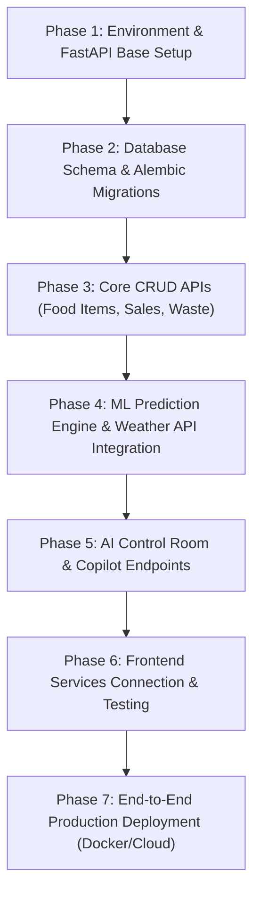

# SmartServe AI - Comprehensive Backend Integration Plan

## Executive Audit Summary

SmartServe AI is a commercial AI-driven restaurant operations and food waste reduction frontend platform built with **React 19**, **Vite 8**, and **Tailwind CSS 4**.

This document outlines the detailed audit of the existing codebase and provides an exhaustive, production-grade integration blueprint to connect the React frontend with a **FastAPI / Python (or Node.js) Backend** equipped with ML model inference services.

---

## 1. Codebase Audit

### 1.1 Complete File Structure
```
c:\Projects\SmartServe-AI
├── .env.example / .env          # Vite environment variables (VITE_API_URL, VITE_USE_MOCK_DATA)
├── package.json                 # Frontend dependencies and scripts
├── vite.config.js               # Vite plugin configuration
├── index.html                   # HTML entry point
├── src/
│   ├── main.jsx                 # Application DOM root
│   ├── App.jsx                  # Main router switcher and layout frame
│   ├── App.css / index.css      # Core styles & Tailwind imports
│   ├── components/
│   │   ├── AiChatFloatingBot.jsx# Universal floating AI copilot modal/widget
│   │   ├── AnimatedCounter.jsx  # Number animation utility
│   │   ├── DigitalTwinGraph.jsx # Telemetry node graph visualization
│   │   ├── Modal.jsx            # Reusable popup dialog
│   │   ├── Navbar.jsx           # Top navigation header & search bar
│   │   ├── Sidebar.jsx          # Primary navigation sidebar
│   │   ├── StatCard.jsx         # Metric display card component
│   │   └── VisualFlow.jsx       # Kitchen workflow pipeline diagram
│   ├── pages/
│   │   ├── AiControlRoom.jsx    # Real-time telemetry, timeline forecasts, live alerts
│   │   ├── AiInsights.jsx       # Categorized AI opportunity & risk recommendations
│   │   ├── Analytics.jsx        # Business ROI, sales vs prediction, risk monitors
│   │   ├── Dashboard.jsx        # Executive operational overview
│   │   ├── DataLearning.jsx     # Data engine status, sync history & model retrain
│   │   ├── DemandPrediction.jsx # AI scenario simulator & stress testing lab
│   │   ├── FoodManagement.jsx   # Inventory & food item CRUD operations
│   │   ├── LandingPage.jsx      # SaaS marketing landing page
│   │   ├── NotificationsAlerts.jsx # Alert stream & notification configuration
│   │   ├── PrepRecommendation.jsx# Kitchen batch preparation schedules
│   │   ├── Profile.jsx          # Manager profile settings
│   │   ├── RestaurantNetwork.jsx # Multi-branch cluster telemetries
│   │   ├── SalesData.jsx        # POS sales history & CSV upload portal
│   │   ├── Settings.jsx         # Restaurant parameters & API connection config
│   │   └── WasteTracking.jsx    # Waste logging, root-cause analysis, heatmaps
│   └── services/
│       ├── api.js               # Central HTTP fetch client (FastAPI wrapper)
│       ├── apiService.js        # Monolithic localStorage fallback state manager
│       ├── mockData.js          # Hardcoded initial datasets
│       ├── aiService.js         # AI Insights & Copilot Chat API handler
│       ├── analyticsService.js  # Analytics metrics API handler
│       ├── dashboardService.js  # Dashboard metrics API handler
│       ├── dataService.js       # Data sources & model retrain API handler
│       ├── notificationService.js # Notifications API handler
│       ├── predictionService.js # ML prediction & scenario API handler
│       ├── preparationService.js# Kitchen prep batches API handler
│       ├── restaurantService.js # Branch network API handler
│       ├── salesService.js      # Sales & CSV upload API handler
│       └── wasteService.js      # Waste logging & heatmap API handler
```

### 1.2 Tech Stack & Dependencies
* **React**: `^19.2.8` & `react-dom` `^19.2.8`
* **Build Tool**: `vite` `^8.3.0` with `@vitejs/plugin-react` `^6.1.1`
* **Styling**: `tailwindcss` `^4.3.3` with `@tailwindcss/vite` `^4.3.3`
* **Icons**: `lucide-react` `^1.52.0`
* **Charts**: `recharts` `^3.10.1`
* **State Management**: `@reduxjs/toolkit` `^2.13.0` (Installed in package.json, planned for frontend store setup)
* **Linter**: `oxlint` `^1.81.0`

### 1.3 State Management & Existing API Service Architecture
Currently, `src/services/api.js` defines a lightweight wrapper `fetchApi()` configured to point to `VITE_API_URL` (defaulting to `http://localhost:8000`). When `VITE_USE_MOCK_DATA` is `true` or the server is offline, requests fall back to simulated local state in `localStorage` managed via `apiService.js` and module services in `src/services/`.

---

## 2. Hardcoded Data & Metrics Audit

### 2.1 Dashboard Metrics Requiring Backend APIs
1. **Today Sales**: Revenue amount (e.g., `₹1,48,500`) calculated from daily POS transactions.
2. **Predicted Sales**: AI forecasted daily revenue (e.g., `₹1,56,000`).
3. **Portions Prepared**: Total kitchen portion production (e.g., `1,135`).
4. **Expected Waste**: Portions and percentage expected as waste (e.g., `49 portions (4.2%)`).
5. **Waste Savings This Month**: Accumulated financial savings from waste prevention (e.g., `₹42,800`).
6. **Impact Metrics**: Food Waste reduction (`-23%`), Preparation Accuracy (`+31%`), Potential Savings (`+₹18,400`), Shortage Risk (`-17%`).
7. **Digital Twin Telemetry Nodes**: Expected Customers (`1,248`), Food Demand (`1,086`), Kitchen Prep (`1,135`), Waste Monitor (`49 portions`), Weather Sensor (`78% Rain`), Revenue Telemetry (`₹1,48,500`).

### 2.2 Recharts Data Structures
* **LineChart / AreaChart (Sales & Demand Trends)**:
  `[{ period: string, actual: number, predicted: number, prepared: number, waste: number, costSaved: number }]`
* **BarChart (Hourly Demand Curve)**:
  `[{ hour: string, predicted: number, actual: number }]`
* **BarChart (Scenario Comparison)**:
  `[{ scenario: string, demand: number, prep: number }]`
* **PieChart (Waste by Reason)**:
  `[{ reason: string, percentage: number, value: number, color: string }]`
* **RadarChart (AI Factor Weights)**:
  `[{ factor: string, percentage: number, color: string }]`

---

## 3. Dedicated Page Requirements

### 3.1 DemandPrediction Page
* **Scenario Input Fields**:
  * `food_item_id` (string / UUID)
  * `date` (YYYY-MM-DD)
  * `day_of_week` (Monday - Sunday)
  * `expected_customers` (integer)
  * `historical_sales` (integer)
  * `current_prep` (integer)
  * `weather` ("Sunny", "Heavy Rain", "Heatwave")
  * `temp_c` (number)
  * `rain_probability` (0-100 integer)
  * `is_holiday` (boolean / "Yes"|"No")
  * `special_event` ("None", "Festival", "Corporate Event")
* **Required ML Prediction Output Fields**:
  * `predicted_demand` (integer)
  * `recommended_prep` (integer)
  * `confidence` (percentage, e.g. 94.2)
  * `expected_waste` (integer portions)
  * `shortage_risk` ("Low", "Medium", "High")
  * `trend_percent` (string, e.g. "+18%")
  * `factor_impacts` (Array of `{ name, impact, level, color }`)
  * `explanation` (Natural language AI explanation string)

### 3.2 WasteTracking Page
* **Required Metrics**: Today Waste (kg/portions), Monthly Waste (kg), Financial Loss (₹), Waste Reduction vs Last Month (%).
* **Required Form Fields (Record Waste Entry)**:
  * `item_id` / `item_name` (string)
  * `date` (YYYY-MM-DD)
  * `time` (HH:mm)
  * `qty` (number)
  * `unit` ("portions", "kg", "liters", "bowls")
  * `reason` ("Over-preparation", "Ingredient Spoilage", "Plate Unconsumed", "Preparation Error")
  * `estimated_cost` (number)
  * `notes` (string)
* **Heatmap & Breakdown**: Heatmap array by Day/Time/Item, Root-cause breakdown percentages, Top 5 most wasted foods list.

### 3.3 Analytics Page
* **Required Analytics Data**:
  * ROI Percentage (`+340%`)
  * Total Cost Saved (`₹1,42,800`)
  * Food Waste Prevented (`412 kg`)
  * Overall Prediction Accuracy (`94.2%`)
  * Multi-period trends (Daily, Weekly, Monthly arrays)
  * Food Performance Matrix (Category, Margin, Waste Risk, Sales Volume)
  * Day-of-Week seasonality patterns
  * Automated executive analytics report generation metadata

### 3.4 AiControlRoom Page
* **Timeline Switcher Contexts**: `NOW`, `NEXT 2 HOURS`, `TODAY`, `TOMORROW`, `NEXT 7 DAYS`.
* **Real-time Alert Stream**: Array of `{ id, type, priority, title, time, reason, recommendedAction }`.
* **Explainable AI Factors**: Weights for Historical Sales, Day Pattern, Recent Trend, Weather Impact, Holiday/Event.
* **Weather Telemetry Feed**: Rain probability, temperature, humidity, cold beverage demand change %, hot meal surge %.
* **AI Copilot Chat Endpoint**: `POST /api/v1/ai/chat` taking `{ prompt }` and returning `{ reply, confidence, timestamp }`.
* **Daily AI Briefing**: `GET /api/v1/ai/briefing` returning `{ summaryHeader, points: string[] }`.

---

## 4. Backend Architecture & REST API Specification

### 4.1 Recommended FastAPI Directory Structure
```
backend/
├── app/
│   ├── main.py                  # FastAPI entry point & CORS configuration
│   ├── core/
│   │   ├── config.py            # Environment settings (DB URL, JWT Secret, Model Paths)
│   │   ├── security.py          # Password hashing & JWT token verification
│   │   └── database.py          # SQLAlchemy / AsyncPG session maker
│   ├── models/                  # SQLAlchemy ORM Database Models
│   │   ├── user.py
│   │   ├── food_item.py
│   │   ├── sales.py
│   │   ├── waste.py
│   │   ├── prediction.py
│   │   ├── prep_schedule.py
│   │   ├── notification.py
│   │   └── restaurant.py
│   ├── schemas/                 # Pydantic Request & Response Schemas
│   │   ├── food_item.py
│   │   ├── sales.py
│   │   ├── waste.py
│   │   ├── prediction.py
│   │   ├── ai.py
│   │   └── user.py
│   ├── api/v1/endpoints/        # Route Handlers
│   │   ├── auth.py
│   │   ├── dashboard.py
│   │   ├── food_items.py
│   │   ├── sales.py
│   │   ├── waste.py
│   │   ├── predictions.py
│   │   ├── preparation.py
│   │   ├── analytics.py
│   │   ├── ai.py
│   │   ├── notifications.py
│   │   ├── restaurants.py
│   │   └── data_sources.py
│   ├── services/                # Business Logic & DB CRUD Services
│   └── ml/                      # Machine Learning Engine
│       ├── demand_model.py      # Random Forest / XGBoost / Prophet Inference
│       ├── model_loader.py      # Model weights loader
│       └── retrainer.py         # Batch retraining worker script
├── alembic/                     # Database Migration Scripts
├── tests/                       # Pytest API unit and integration tests
├── requirements.txt             # Python backend dependencies
└── Dockerfile                   # Docker deployment configuration
```

---

## 5. Required Endpoints & JSON Schemas

### 5.1 Authentication (`/api/v1/auth`)
* `POST /api/v1/auth/login`
  * **Request**: `{ "email": "manager@smartserve.ai", "password": "password123" }`
  * **Response**: `{ "access_token": "jwt_token_string", "token_type": "bearer", "user": { "id": "u-1", "name": "Sagar B", "role": "Restaurant Manager", "branch_id": "HYD-BLR-04" } }`

### 5.2 Food Management (`/api/v1/food-items`)
* `GET /api/v1/food-items` -> Returns list of food items
* `POST /api/v1/food-items`
  * **Request**:
    ```json
    {
      "name": "Paneer Tikka",
      "category": "Appetizers",
      "price": 260.0,
      "cost": 90.0,
      "avgDailySales": 50,
      "currentStock": 60,
      "unit": "portions",
      "leadTimeHours": 1.0,
      "shelfLifeDays": 1,
      "tags": ["High Margin", "Chef Special"]
    }
    ```
* `PUT /api/v1/food-items/{id}` -> Update item fields
* `DELETE /api/v1/food-items/{id}` -> Delete item

### 5.3 ML Demand Prediction (`/api/v1/predict`)
* `POST /api/v1/predict`
  * **Request**:
    ```json
    {
      "food_item": "Veg Biryani",
      "food_item_id": "item-001",
      "date": "2026-10-09",
      "day": "Friday",
      "historical_sales": 80,
      "expected_customers": 120,
      "weather": "Rainy",
      "temperature": 26.5,
      "rain_probability": 78,
      "holiday": false,
      "event": "None"
    }
    ```
  * **Response**:
    ```json
    {
      "predicted_demand": 95,
      "recommended_preparation": 101,
      "confidence": 94.2,
      "expected_waste": 6,
      "shortage_risk": "Low",
      "unit": "portions",
      "trend_percent": "+18.7%",
      "factors": [
        "Friday Dinner Surge (+18%)",
        "Rainy Weather Impact (+15%)",
        "Recent Sales Trend (+12%)"
      ],
      "factor_impacts": [
        { "name": "Historical Sales", "impact": "High Impact", "level": "high", "color": "bg-[#1b4332] text-white" },
        { "name": "Weather (Rain Surge)", "impact": "Medium Impact", "level": "medium", "color": "bg-[#d4af37]/20 text-amber-900" }
      ],
      "explanation": "AI model predicted 95 portions demand for Veg Biryani based on Friday footfall, rainy weather forecast, and recent sales trends."
    }
    ```

### 5.4 Waste Tracking (`/api/v1/waste`)
* `GET /api/v1/waste` -> Returns waste metrics summary and breakdown
* `POST /api/v1/waste`
  * **Request**:
    ```json
    {
      "item_name": "Paneer Curry",
      "food_item_id": "item-002",
      "date": "2026-10-08",
      "time": "14:30",
      "qty": 8,
      "unit": "portions",
      "reason": "Over-preparation",
      "financial_loss": 240.0,
      "notes": "Excess prep during lunch shift."
    }
    ```

### 5.5 Sales Telemetry & Upload (`/api/v1/sales`)
* `GET /api/v1/sales` -> Historical sales trends and telemetry
* `POST /api/v1/sales` -> Log individual sales transaction
* `POST /api/v1/sales/upload` (Multipart `multipart/form-data`) -> Upload POS CSV file.
  * **Response**: `{ "success": true, "records_processed": 1420, "data_quality_score": "96.4%" }`

### 5.6 AI Control Room & Copilot (`/api/v1/ai`)
* `GET /api/v1/ai/insights` -> Categorized AI insights list
* `GET /api/v1/ai/briefing` -> Daily morning executive briefing
* `POST /api/v1/ai/chat`
  * **Request**: `{ "prompt": "Why is Paneer Curry waste high today?" }`
  * **Response**:
    ```json
    {
      "reply": "Paneer Curry accounted for 18 portions (₹540 loss) yesterday due to over-preparation during the 12:30 - 2:30 PM lunch batch. SmartServe AI recommends reducing tomorrow's prep batch by 8 portions.",
      "confidence": 96.0,
      "timestamp": "19:40:00"
    }
    ```

---

## 6. Required Database Entities & Relational Schema (PostgreSQL)

```sql
-- Users & Auth Table
CREATE TABLE users (
    id VARCHAR(36) PRIMARY KEY,
    name VARCHAR(100) NOT NULL,
    email VARCHAR(150) UNIQUE NOT NULL,
    password_hash VARCHAR(255) NOT NULL,
    role VARCHAR(50) DEFAULT 'Restaurant Manager',
    branch_id VARCHAR(50) DEFAULT 'HYD-BLR-04',
    created_at TIMESTAMP DEFAULT CURRENT_TIMESTAMP
);

-- Food Items Inventory Table
CREATE TABLE food_items (
    id VARCHAR(36) PRIMARY KEY,
    name VARCHAR(100) NOT NULL,
    category VARCHAR(50) NOT NULL,
    price NUMERIC(10, 2) NOT NULL,
    cost NUMERIC(10, 2) NOT NULL,
    avg_daily_sales INT DEFAULT 0,
    current_stock INT DEFAULT 0,
    unit VARCHAR(30) DEFAULT 'portions',
    lead_time_hours NUMERIC(4, 1) DEFAULT 1.0,
    shelf_life_days INT DEFAULT 1,
    ai_optimized BOOLEAN DEFAULT TRUE,
    image_url TEXT,
    tags JSONB DEFAULT '[]'::jsonb,
    created_at TIMESTAMP DEFAULT CURRENT_TIMESTAMP
);

-- Daily Sales Records Table
CREATE TABLE sales_records (
    id VARCHAR(36) PRIMARY KEY,
    food_item_id VARCHAR(36) REFERENCES food_items(id) ON DELETE CASCADE,
    date DATE NOT NULL,
    quantity_sold INT NOT NULL,
    revenue NUMERIC(10, 2) NOT NULL,
    created_at TIMESTAMP DEFAULT CURRENT_TIMESTAMP
);

-- Waste Audit Logs Table
CREATE TABLE waste_logs (
    id VARCHAR(36) PRIMARY KEY,
    food_item_id VARCHAR(36) REFERENCES food_items(id) ON DELETE CASCADE,
    item_name VARCHAR(100) NOT NULL,
    date DATE NOT NULL,
    time VARCHAR(10),
    quantity NUMERIC(10, 2) NOT NULL,
    unit VARCHAR(30) NOT NULL,
    reason VARCHAR(100) NOT NULL,
    financial_loss NUMERIC(10, 2) NOT NULL,
    notes TEXT,
    created_at TIMESTAMP DEFAULT CURRENT_TIMESTAMP
);

-- ML Predictions & Scenarios Table
CREATE TABLE demand_predictions (
    id VARCHAR(36) PRIMARY KEY,
    food_item_id VARCHAR(36) REFERENCES food_items(id) ON DELETE CASCADE,
    prediction_date DATE NOT NULL,
    day_of_week VARCHAR(20) NOT NULL,
    predicted_demand INT NOT NULL,
    recommended_prep INT NOT NULL,
    confidence NUMERIC(5, 2) NOT NULL,
    expected_waste INT DEFAULT 0,
    shortage_risk VARCHAR(20) DEFAULT 'Low',
    weather_condition VARCHAR(50),
    rain_probability INT,
    factors JSONB DEFAULT '[]'::jsonb,
    explanation TEXT,
    created_at TIMESTAMP DEFAULT CURRENT_TIMESTAMP
);

-- Preparation Batches Table
CREATE TABLE preparation_batches (
    id VARCHAR(36) PRIMARY KEY,
    food_item_id VARCHAR(36) REFERENCES food_items(id) ON DELETE CASCADE,
    batch_size INT NOT NULL,
    prepare_time VARCHAR(20) NOT NULL,
    status VARCHAR(30) DEFAULT 'Scheduled', -- Scheduled, In Progress, Completed
    station VARCHAR(50) DEFAULT 'Station A',
    date DATE NOT NULL
);

-- Realtime Alerts Table
CREATE TABLE notifications (
    id VARCHAR(36) PRIMARY KEY,
    type VARCHAR(30) NOT NULL, -- warning, critical, opportunity, shortage
    priority VARCHAR(20) NOT NULL, -- HIGH, CRITICAL, OPPORTUNITY, MEDIUM
    title VARCHAR(150) NOT NULL,
    time_label VARCHAR(50),
    reason TEXT NOT NULL,
    recommended_action TEXT NOT NULL,
    is_read BOOLEAN DEFAULT FALSE,
    created_at TIMESTAMP DEFAULT CURRENT_TIMESTAMP
);

-- Restaurant Configuration Table
CREATE TABLE restaurant_config (
    branch_id VARCHAR(50) PRIMARY KEY,
    name VARCHAR(150) NOT NULL,
    cuisine VARCHAR(100),
    capacity_seats INT DEFAULT 120,
    avg_daily_orders INT DEFAULT 540,
    ai_prep_safety_buffer_percent NUMERIC(5, 2) DEFAULT 6.0,
    waste_threshold_alert_kg NUMERIC(5, 2) DEFAULT 10.0,
    currency_symbol VARCHAR(10) DEFAULT '₹'
);
```

---

## 7. External API Integrations & ML Requirements

### 7.1 External APIs
1. **Weather Radar API**: Integrates with OpenWeatherMap / Tomorrow.io to pull live temperature, humidity, condition, and rain probability telemetry.
2. **Calendar / Holiday API**: Integrates with Abstract Holiday API or Nager.Date API for national/regional holiday surge detection.

### 7.2 ML Model Requirements
* **Input Features**: `[food_item_id, day_of_week, month, historical_7day_avg_sales, expected_customers, weather_condition, rain_prob, is_holiday, special_event_type, recent_3day_waste_avg]`
* **Model Algorithms**: XGBoost Regressor or Random Forest Regressor trained on historical POS sales and weather logs.
* **Output Predictions**: Point forecast demand integer, 95% prediction confidence interval bounds, safety buffer recommended preparation integer, and SHAP explainability weights for factor impacts.

---

## 8. Integration Roadmap & Implementation Order



### Order of Steps
1. **Phase 1 (Backend Foundation)**: Initialize FastAPI app, CORS middleware, Pydantic schemas, and JWT Auth.
2. **Phase 2 (Database Layer)**: Provision PostgreSQL database, create SQLAlchemy models, and run Alembic migrations.
3. **Phase 3 (Core Telemetry Endpoints)**: Implement `/api/v1/food-items`, `/api/v1/sales`, `/api/v1/waste`, and `/api/v1/dashboard`.
4. **Phase 4 (ML & Scenario Simulator)**: Integrate Python ML inference engine (`XGBoost`/`scikit-learn`) and Weather API service for `/api/v1/predict`.
5. **Phase 5 (AI Copilot & Notifications)**: Implement `/api/v1/ai/chat`, `/api/v1/ai/insights`, and `/api/v1/notifications`.
6. **Phase 6 (Frontend Wiring)**: Update `src/services/api.js` to set `USE_MOCK_DATA = false` and verify response schema mapping.
7. **Phase 7 (Production Validation)**: Deploy backend container to AWS/GCP/Cloud Run with SSL and connection pooling.
